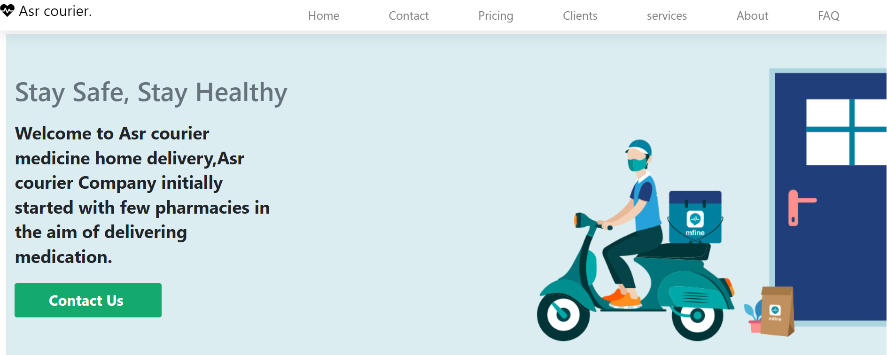
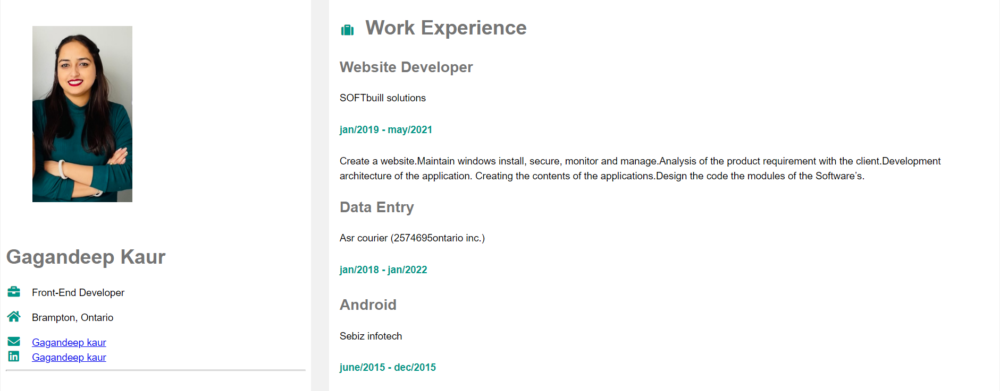
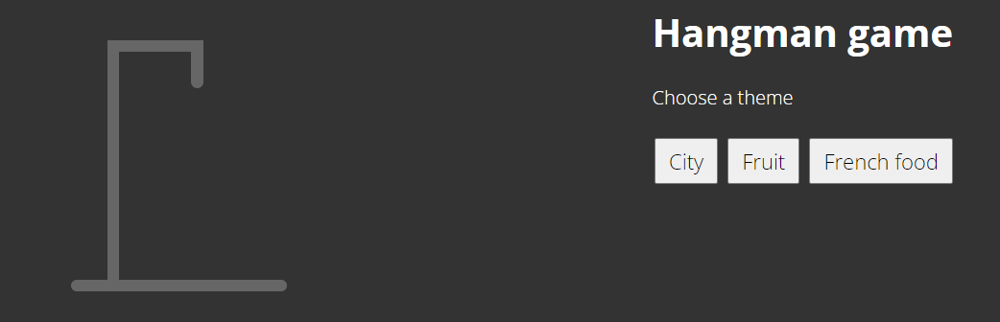
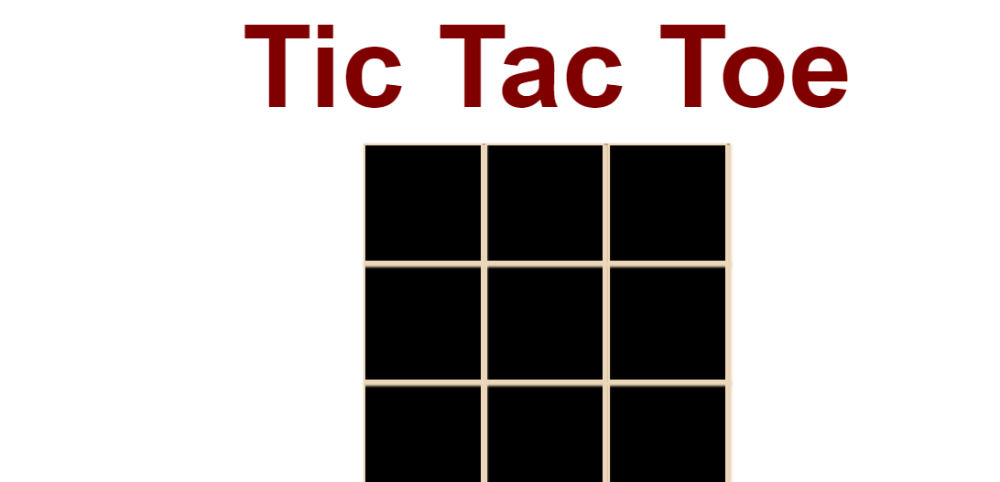

<!DOCTYPE html>
<html lang="en">
<head>
    <meta charset="UTF-8">
    <meta http-equiv="X-UA-Compatible" content="IE=edge">
    <meta name="viewport" content="width=device-width, initial-scale=1.0">
    <!-- bootstrap  -->
    <link rel="stylesheet" href="https://cdn.jsdelivr.net/npm/bootstrap@4.0.0/dist/css/bootstrap.min.css" integrity="sha384-Gn5384xqQ1aoWXA+058RXPxPg6fy4IWvTNh0E263XmFcJlSAwiGgFAW/dAiS6JXm" crossorigin="anonymous">
     
    <link href="https://cdn.jsdelivr.net/npm/bootstrap@5.0.2/dist/css/bootstrap.min.css" rel="stylesheet" integrity="sha384-EVSTQN3/azprG1Anm3QDgpJLIm9Nao0Yz1ztcQTwFspd3yD65VohhpuuCOmLASjC" crossorigin="anonymous">
    <!-- <link ref ="" href = "style.css"> -->
    <!-- google font -->
    
      <link rel="preconnect" href="https://fonts.googleapis.com">
<link rel="preconnect" href="https://fonts.gstatic.com" crossorigin>
<link href="https://fonts.googleapis.com/css2?family=Anek+Tamil:wght@200&family=Roboto+Condensed:wght@300&display=swap" rel="stylesheet">
<!-- icon  -->
<link rel = "icon" href = "https://fontawesome.cc/Brands/#:~:text=%20%20%20%20Class%20Name%20%20,%20%20%EF%9A%AF%20%2084%20more%20rows%20">
<link rel="stylesheet" href="path/to/font-awesome/css/font-awesome.min.css">
    <title>Document</title>
</head>
<body>
    
     <!-- Navbar Start -->
     <nav class="navbar fixed-top shadow-sm navbar-expand-lg bg-dark navbar-dark py-3 py-lg-0 px-lg-5">
        <a href="index.html" class="navbar-brand ml-lg-5">
            <h1 class="m-0 display-5">GaganKaur</h1>
        </a>
        <button type="button" class="navbar-toggler" data-toggle="collapse" data-target="#navbarCollapse"  aria-controls="navbarNavDropdown"
        aria-expanded="false" aria-label="Toggle navigation">
            
            
        </button>
        

            

                <li>
                <a href="#home" class="nav-item nav-link active">Home</a>
                </li>
                <a href="#about" class="nav-item nav-link">About</a>
                <a href="#qualification" class="nav-item nav-link">Quality</a>
                <a href="#skill" class="nav-item nav-link">Skill</a>
                
                <a href="#portfolio" class="nav-item nav-link">Work</a>
                <a href="#testimonial" class="nav-item nav-link">Review</a>
                <a href="#contact" class="nav-item nav-link">Contact</a>
                
            

            
            <!-- <a href="" class="btn btn-menu d-none d-lg-block" style="background-color: rgb(116, 227, 214); color: #ffffff;">Hire Me</a> -->
        

    </nav>
    <!-- Navbar End -->
     <!-- Header Start -->
     

        <canvas id="canv"></canvas>
        

            
            

                

                    
                

                
 Hello,  My Name  Gagandeep Kaur 

                        

                    

                

                    
                    <h3 class="text-white font-weight-normal mb-3">Hello, my name</h3>
                    <h1 class=" shadow display-3 text-uppercase text-danger mb-2" style="-webkit-text-stroke: 4px #ffffff;">Gagandeep Kaur</h1>
                    
                    <h1 class="typed-text-output d-inline font-weight-lighter text-white"></h1>
                    <h3 class="typed-text text-white">Front End web Developer</h3>
                    

                        <a href="https://drive.google.com/file/d/1ctva238R4QzdZMVVLAVbTaFP0-En-3n7/view?usp=sharing" target="_blank"  class="btn btn-danger col-7">Download CV</a>

                        <!-- <a href="" class="btn btn-secondary d-none d-sm-block">Play Video</a> -->
                    

                

                
            

           
    <!-- Header End -->
    <!-- About Start -->
  

    

        

            <h1 class="display-1 text-uppercase text-white" style="-webkit-text-stroke: 1px #dee2e6;">About</h1>
            <h1 class="position-absolute text-uppercase text-danger">About Me</h1>
        

        

            

                
            

            

                <h3 class="mb-4"> I'm Front End Web Developer  from Brampton, Canada</h3>
                
 I enjoy working with computers. Coding is something I enjoy doing. I love everything about them. I spend eight to ten hours a day in front of a computer screen as I am coding, Designing. I enjoy learning new stuff.

                
I've enjoyed turning complex problems into simple, beautiful, and intuitive designs. I will provide a responsive website. I also make the websites more attractive.

                
I'm a computer science and engineering master's degree holder. In addition, I am a certified front end web developer.

                 <a href="https://mail.google.com/mail/u/0/?msclkid=7b28d2dbb45111ecbf776b6902331a3a#inbox" target="_blank" class="btn btn-danger ">Lets Talk</a>
                  
                
            

        

    

<!-- About End -->
<!-- skills bar start -->

    

        

            <h1 class="display-1 text-uppercase text-white" style="-webkit-text-stroke: 1px #dee2e6;">Skills</h1>
            <h1 class="position-absolute text-uppercase text-danger">My Skills</h1>
        

        

            

                

                    

                        <h6 class="font-weight-bold">HTML</h6>
                        <h6 class="font-weight-bold">95%</h6>
                    

                    

                        

                      

                

                

                    

                        <h6 class="font-weight-bold">CSS</h6>
                        <h6 class="font-weight-bold">90%</h6>
                    

                    

                        

                      

                

                

                    

                        <h6 class="font-weight-bold">Bootstarp</h6>
                        <h6 class="font-weight-bold">80%</h6>
                    

                    

                        

                      

                

                

                    

                        <h6 class="font-weight-bold">PHP</h6>
                        <h6 class="font-weight-bold">60%</h6>
                    

                    

                        

                      

                

            

            

                

                    

                        <h6 class="font-weight-bold">Javascript</h6>
                        <h6 class="font-weight-bold">80%</h6>
                    

                    

                        

                    

                

                

                    

                        <h6 class="font-weight-bold">sass</h6>
                        <h6 class="font-weight-bold">80%</h6>
                    

                    

                        

                      

                

                

                    

                        <h6 class="font-weight-bold">React </h6>
                        <h6 class="font-weight-bold">75%</h6>
                    

                    

                        

                      

                

                

                    

                        <h6 class="font-weight-bold">Wordpress</h6>
                        <h6 class="font-weight-bold">70%</h6>
                    

                    

                        

                      

                

            

        

    

<!-- Skill End -->
<!-- soft skills bar start -->

    

        

            <h1 class="display-1 text-uppercase text-white" style="-webkit-text-stroke: 1px #dee2e6;">My Soft Skills</h1>
            <!-- <h1 class="position-absolute text-uppercase text-danger">My Soft Skills</h1> -->
        

    

    

        
    

   

<!-- Qualification Start -->

    

        

            <h1 class="display-1 text-uppercase text-white" style="-webkit-text-stroke: 1px #dee2e6;">Quality</h1>
            <h1 class="position-absolute text-uppercase text-danger">Education & Expericence</h1>
        

        

            

                <h3 class=" text-danger mb-4">My Education </h3>
                

                    

                        <i class="far fa-dot-circle text-danger position-absolute" style="top: 2px; left: -35px; font-size: 22px;"></i>
                        <h5 class="font-weight-bold mb-1">Master in CSE</h5>
                        <!-- 
Computer science & engineering
 -->
                        
<strong></strong> | <small>2016 - 2018</small>

                        <!-- 
GPA 4.0
 -->
                    

                    

                        <i class="far fa-dot-circle text-danger position-absolute" style="top: 2px; left: -35px;  font-size: 22px;"></i>
                        <h5 class="font-weight-bold mb-1">Beachlor in CSE</h5>
                        <!-- 
Computer science & engineering
 -->
                        
<strong></strong> | <small>2013 - 2016</small>

                        <!-- 
GPA 3.34
 -->
                    

                    

                        <i class="far fa-dot-circle text-danger position-absolute" style="top: 2px; left: -35px;  font-size: 22px;"></i>
                        <h5 class="font-weight-bold mb-1">Diploma in CSE</h5>
                        <!-- 
Computer engineering
 -->
                        
<strong></strong> | <small>2010 - 2013</small>

                        <!-- 
GPA3.73
 -->
                    

                    

                        <i class="far fa-dot-circle text-danger position-absolute" style="top: 2px; left: -35px;  font-size: 22px;"></i>
                        <h3 class=" mb-2 text-danger">Certification</h3>
                        
Front End Web Developer

                        
<strong></strong> | <small>2022</small>

                        
Front End Web Developer with React

                        
<strong></strong> | <small>2022</small>

                        
Android

                        
<strong></strong> | <small>2015</small>

                        
PHP&MySql

                        
<strong></strong> | <small>2014</small>

                        
                    

                

            

            

                <h3 class=" text-danger mb-4">My Expericence</h3>
                

                    

                        <i class="far fa-dot-circle text-danger position-absolute" style="top: 2px;left: -35px;  font-size: 22px;"></i>
                        <h5 class="font-weight-bold mb-1">Website Developer</h5>
                        
<strong>Softbuilt Company</strong> | <small> Excellent</small>

                        
     Efficiently maintained, secured, monitored and managed windows installation.Analyzed the product requirement with the client to make sure goals were clearly defined and expectations were met.
                                Planned website development and converted mockups into usable web presence with HTML, CSS, JavaScript coding. Designed, implemented, and monitored web pages, plugging and functionality for continuous improvement.
                                Implemented website maintenance, content management, updates and security resource tutorials to assist end-user training. Provided front-end website development using WordPress and other editing software.
                                Conducted testing and review of website design for responsiveness, clarity and effectiveness.

                            

                    

                    

                        <i class="far fa-dot-circle text-danger position-absolute" style="top: 2px;left: -35px;  font-size: 22px;"></i>
                        <h5 class="font-weight-bold mb-1">Data Entry (Part Time)</h5>
                        
<strong>Asr Courier Company</strong> | <small> Excellent</small>

                        
 Identified, corrected and reported data entry errors. Used Microsoft Excel and other software tools to create documents. Scanned documents and saved them in the database to keep records of essential organizational dangerrmation.
                                Completed data entry tasks with accuracy and efficiency.Reviewed completed work for compliance with regulations.Gathered and documented statistical dangerrmation to generate reports.
                            

                    

                

            

        

    

<!-- Qualification End -->
<!-- Portfolio Start -->
 

    

        

            <h1 class="display-1 text-uppercase text-white" style="-webkit-text-stroke: 1px #dee2e6;">Work</h1>
            <!-- <h1 class="position-absolute text-uppercase text-danger">My Portfolio</h1> -->
        

        

            

                <ul class="list-inline mb-4" id="portfolio-flters">
                    <li class="btn btn-sm btn-outline-danger m-1 active"  data-filter="*">All</li>
                    <a href = "https://asrcourier.com/" class="btn btn-sm btn-outline-danger m-1 " target="_blank" data-filter=".first">Courier Website</a>
                    <a href = "https://vlq5i.csb.app/" class="btn btn-sm btn-outline-danger m-1 " target="_blank" data-filter=".first">Resume</a>
                    <a href = "https://hle36s.csb.app/" class="btn btn-sm btn-outline-danger m-1 " target="_blank" data-filter=".first">Design Tic Tac Toe</a>
                    <a href = "https://ej9bbp.csb.app/" class="btn btn-sm btn-outline-danger m-1 " target="_blank" data-filter=".first">Design Hangman</a>
                </ul>
            

        

        

            

                

                    
                    

                        <a href="img/asr.png" data-lightbox="portfolio">
                            <i class="fa fa-plus text-white" style="font-size: 60px;"></i>
                        </a>
                    

                

            

            

                

                    
                    

                        
                            <i class="fa fa-plus text-white" style="font-size: 60px;"></i>
                        </a>
                    

                

            

            

                

                     <a href="https://ej9bbp.csb.app/" data-lightbox="portfolio">

                    
                    

                     <i class="fa fa-plus text-white" style="font-size: 60px;"></i>
                        </a>
                    

                

            

            

                

                    <a href="https://hle36s.csb.app/" data-lightbox="portfolio">
                    
                    

                        
                            <i class="fa fa-plus text-white" style="font-size: 60px;"></i>
                        </a>
                    

                

            

           
            <!-- 

                

                    
                    

                        <a href="img/portfolio-5.jpg" data-lightbox="portfolio">
                            <i class="fa fa-plus text-white" style="font-size: 60px;"></i>
                        </a>
                    

                

            

            

                

                    
                    

                        <a href="img/portfolio-6.jpg" data-lightbox="portfolio">
                            <i class="fa fa-plus text-white" style="font-size: 60px;"></i>
                        </a>
                    

                

            
 -->
        

    

<!-- Portfolio End -->
 <!-- Testimonial Start -->
 

    

        

            <h1 class="display-1 text-uppercase text-white" style="-webkit-text-stroke: 1px #dee2e6;">Review</h1>
            <h1 class="position-absolute text-uppercase text-danger">Clients Say</h1>
        

        

            

                

                    

                        <i class="fa fa-3x fa-quote-left text-danger mb-4"></i>
                        <h4 class="font-weight-light mb-4">"Loved the work done by Gagandeep Kaur. Beautifully designed website according to our needs. It helped us to get more business and spread the word about our services. Its 10 out of 10 from me."</h4>
                        <!--  -->
                        <h5 class="font-weight-bold m-0">Asr courier</h5>
                        <!-- Profession -->
                    

                    

                    

                    

                    

                        <i class="fa fa-3x fa-quote-left text-danger mb-4"></i>
                        <h4 class="font-weight-light mb-4">"Gagan was not only easy to work with, but her problem solving  was also excellent. She met every deadline, and also offered sound suggestions that added to the quality of each of our projects. Because of this, we were able to complete a project that generally takes six weeks in only four weeks.”</h4>
                        <!--  -->
                        <h5 class="font-weight-bold m-0">Sahil Mahajan</h5>
                        <!-- Profession -->
                    

                    

                    

                    

                        <i class="fa fa-3x fa-quote-left text-danger mb-4"></i>
                        <h4 class="font-weight-light mb-4">"Gagandeep is working with us from last three years. She has great attitude, dedication about what she do. Very passionate and innovative. We never had a complaint about work. Getting our daily,monthly entries on time. She is pillar of the company."</h4>
                        <!--  -->
                        <h5 class="font-weight-bold m-0">Baljinder singh</h5>
                        <!-- Profession -->
                    

                    

                

            

        

    

<!-- Testimonial End -->
<!-- Contact Start -->

    

        

            <h1 class="display-1 text-uppercase text-white" style="-webkit-text-stroke: 1px #dee2e6;">Contact Me</h1>
            <!-- <h1 class="position-absolute text-uppercase text-danger">Contact Me</h1> -->
        

        

            

                

                    

                    <form name="sentMessage" id="contact" novalidate="novalidate">
                        

                            

                                <input type="text" class="form-control p-4" id="name" placeholder="Your Name"
                                    required="required" data-validation-required-message="Please enter your name" />
                                

                            

                            

                                <input type="email" class="form-control p-4" id="email" placeholder="Your Email"
                                    required="required" data-validation-required-message="Please enter your email" />
                                

                            

                        

                        

                            <input type="text" class="form-control p-4" id="subject" placeholder="Subject"
                                required="required" data-validation-required-message="Please enter a subject" />
                            

                        

                        

                            <textarea class="form-control py-3 px-4" rows="5" id="message" placeholder="Message"
                                required="required"
                                data-validation-required-message="Please enter your message"></textarea>
                            

                        

                        

                            <button class="btn btn-outline-danger" type="submit" id="submit">Send
                                Message</button>
                        

                    </form>
                    

                    

                

            

        

    

<!-- Contact End -->
 <!-- Footer Start -->
 

    

        

            <a class="btn btn-light btn-social mr-2" href="#"><i class="fa fa-twitter-square" aria-hidden="true"> Twitter</i>
            </a>
            <!-- <a class="btn btn-light btn-social mr-2" href="#"><i class="fab fa-facebook-f">Facebook</i></a> -->
            <a class="btn btn-light btn-social mr-2" href="https://www.linkedin.com/in/gagandeep-kaur-75684515a/" target="_blank"><i class="fab fa-linkedin-in">Linkedin</i></a>
            <a class="btn btn-light btn-social" href="https://mail.google.com/mail/u/0/?msclkid=7b28d2dbb45111ecbf776b6902331a3a#inbox" target="_blank"><i class="fab fa-Email">Email </i></a>
        

        <!-- 

            <a class="text-white" href="#">Privacy</a>
            |
            <a class="text-white" href="#">Terms</a>
            |
            <a class="text-white" href="#">FAQs</a>
            |
            <a class="text-white" href="#">Help</a>
        
 -->
        
 All Rights Reserved. Designed by <a class="text-white font-weight-bold" href="#">Gagandeep Kaur</a>
        

    

<!-- Footer End -->
<!-- Back to Top -->
<!-- <a href="#" class="btn btn-outline-dark px-0 back-to-top"><i class="fa fa-angle-double-up"></i></a> -->

<!--  -->
     

</body>
</html>
